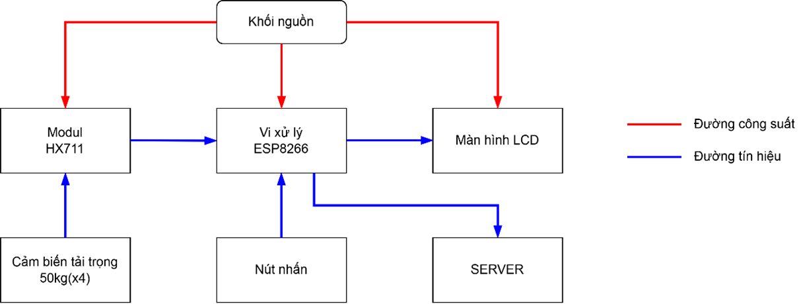
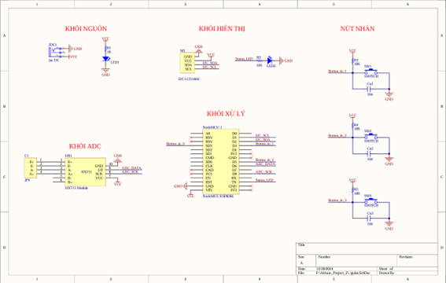
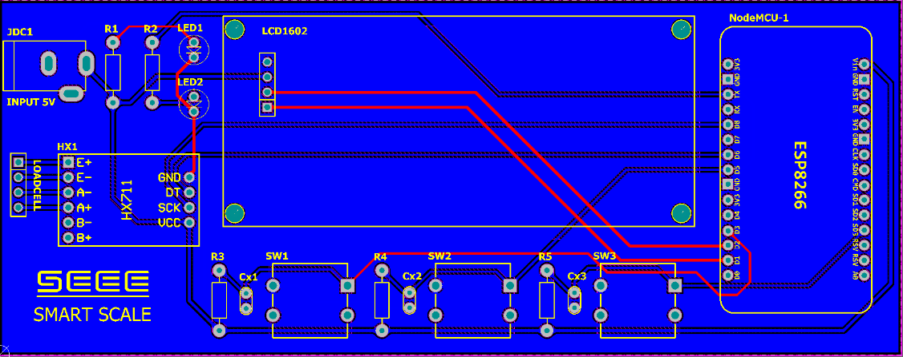
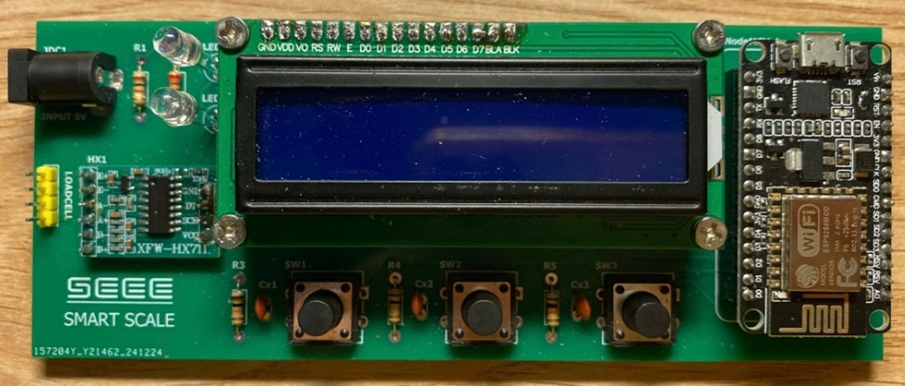

# SMART SCALE

## 🚀 Giới thiệu
Dự án **Cân Thông Minh** sử dụng **ESP8266**, **HX711** để đo trọng lượng, hiển thị trên LCD1602, và gửi dữ liệu lên server qua **HTTP POST**.  
Phần cứng được thiết kế trên **Altium Designer**, tích hợp cảm biến Load Cell qua **HX711**.

---

## 🛠️ Công nghệ sử dụng
-  Nền tảng phát triển cho ESP8266  
- 🌐 HTTP Request – Gửi dữ liệu lên server qua phương thức POST  
- 🖥️ Altium Designer – Thiết kế mạch nguyên lý, PCB và 3D  

---

### Sơ đồ khối hệ thống


### Sơ đồ nguyên lý


### 🔌 Thiết kế phần cứng
- **ESP8266**: Vi điều khiển Wi-Fi mạnh mẽ, lập trình dễ dàng, hỗ trợ OTA.  
- **HX711**: ADC 24-bit, khuếch đại tín hiệu load cell.  
- **LCD1602 + I2C**: Hiển thị thông tin, tiết kiệm chân GPIO.  
- **Cân điện tử thông dụng (Kèm LoadCell)**: Gửi tín hiệu tới HX711.  

### 💻 Thiết kế phần mềm
- Kết nối Wi-Fi, đọc dữ liệu từ HX711.  
- Hiển thị trên LCD1602.  
- Gửi dữ liệu qua HTTP POST tới server.  
- Lưu trữ vào CSDL SQL thông qua script PHP.

### Thiết kế PCB


### Sản phẩm hoàn chỉnh


---

## 🖱️ Hướng dẫn sử dụng
1. **Nạp chương trình** vào ESP8266 bằng ESP-IDF:
   ```bash
   idf.py -p COMx flash monitor
   ```
2. **Cấu hình Wi-Fi** Smart Config tại địa chỉ 192.168.4.1
3. **Khởi động hệ thống**, xem dữ liệu trên LCD và Web.